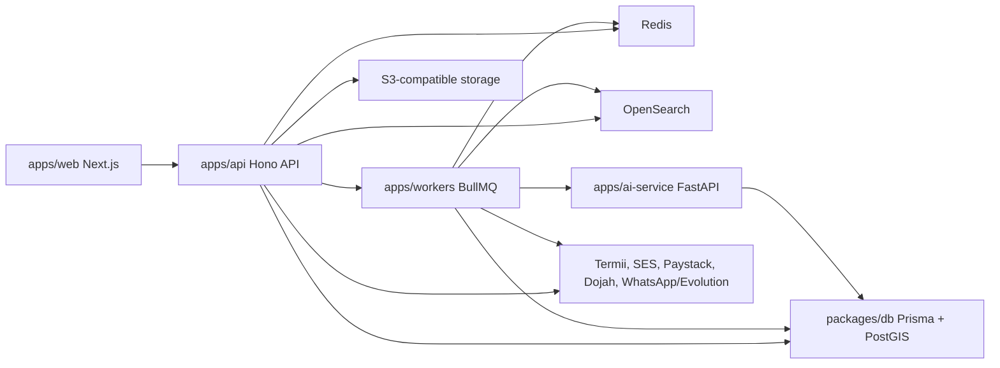

# LandShoppers Next Phase Development Plan

Date: 2026-05-10

Status: draft for review

Purpose: define the next build phase after the foundation/dashboard-route fixes. This document divides work across multiple agents, describes the target UI and architecture, and sets a Redfin-class product direction adapted to LandShoppers, Nigeria, developers, WhatsApp ingestion, and OutcomeLabs SEO.

## 1. Current Baseline

The repo now has a working monorepo foundation:

- `apps/web`: Next.js public site, auth pages, buyer/agent/developer/admin dashboard shells.
- `apps/api`: Hono API with health, auth, listings, search/listing contracts, Prisma access.
- `apps/ai-service`: FastAPI AI fixture service with extraction and SEO endpoints.
- `apps/workers`: BullMQ worker skeletons.
- `packages/db`: Prisma schema, migrations, seed, PostGIS verification.
- Docker Compose: PostGIS, Redis, OpenSearch.

Recently fixed:

- Buyer, agent, developer, and admin dashboard routes no longer 404.
- Signup/login/OTP redirects now use the user role.
- Public linked routes such as `/developers`, `/blog`, `/about`, `/contact`, `/terms`, and `/privacy` exist.
- Build and lint pass.

Known constraints:

- Several pages are route shells, not final feature-complete dashboards.
- Docker Desktop must be running locally for DB/Redis/OpenSearch runtime checks.
- Search is still not Redfin-class: no map split view, clustering, autocomplete, ranking, saved alerts, or neighborhood intelligence yet.
- Agent/developer/admin workflows are not fully API-backed.

## 2. Next Phase Goal

Build a high-quality vertical slice that proves LandShoppers can behave like a modern real estate marketplace, not just a static portal.

The next phase should deliver:

1. A Redfin-class property discovery experience:
   - search results with map/list split view
   - rich filters
   - geospatial search
   - saved searches
   - recently viewed listings
   - strong listing detail pages

2. Role-specific dashboards that do useful work:
   - buyer saves/searches/inquiries
   - agent creates and manages listings/leads
   - developer manages projects/units/leads
   - admin moderates users/listings/WhatsApp/SEO queues

3. A reliable backend slice:
   - authenticated APIs
   - RBAC
   - OpenSearch/PostGIS search
   - Redis-backed jobs and rate limits
   - test coverage

4. A modern automation spine:
   - WhatsApp message ingestion
   - AI extraction
   - human approval
   - listing creation
   - SEO variant generation

## 3. Product Direction: Redfin-Class, LandShoppers-Specific

Do not copy Redfin visually. Use it as a benchmark for speed, trust, map-first discovery, and buyer decision support.

### Marketplace Experience

The primary browsing mode should be a split search surface:

- Left or right panel: scrollable listing cards.
- Opposite panel: sticky interactive map.
- Filters remain visible and fast.
- Selecting a card highlights the map pin.
- Selecting a pin opens a compact listing preview.
- Results update from map bounds and filters.
- Mobile uses tabs or a segmented control: List / Map.

### Listing Cards

Cards should be dense and decision-focused:

- image carousel or first image with count
- price in kobo-formatted Naira
- beds, baths, area, property type
- city/neighborhood
- verification badge
- save button
- compare checkbox
- days on market
- agent/developer label

### Listing Detail

Detail pages should support buyer confidence:

- gallery with full-screen mode
- sticky inquiry CTA
- price, specs, location, status, verification
- map and nearby landmarks
- mortgage/affordability calculator
- agent/developer contact panel
- similar listings
- price history
- document/verification status
- SEO-ready structured data

### Buyer Intelligence

Buyer dashboard should move beyond a shell:

- saved properties
- saved searches with alert frequency
- inquiry status tracker
- tour requests
- recently viewed listings
- recommended listings from search history
- notification inbox

### Agent/Developer Operating Tools

Agent and developer portals should feel operational:

- dense tables with filters, status badges, quick actions
- create/edit listing forms with validation
- lead inbox with status pipeline
- analytics cards tied to real data
- subscription/KYC status
- clear empty states and next actions

### Admin Trust Layer

Admin should protect marketplace quality:

- pending listings
- flagged listings
- users/agents/developers
- KYC status
- WhatsApp extraction queue
- SEO approval queue
- audit log
- platform settings

## 4. Target Architecture

### High-Level System



### Backend Patterns

Use a service boundary but avoid overengineering:

- API routes validate all input with Zod.
- Every mutation enforces `requireAuth` and role/ownership checks.
- Search write path uses jobs, not synchronous indexing.
- Every external webhook uses signature validation and idempotency.
- Critical state changes write audit logs.
- Worker jobs are retried with dead-letter records.
- AI calls are logged with model, cost estimate, latency, and result status.

### Search Architecture

Search should combine OpenSearch and PostGIS:

- OpenSearch handles text, autocomplete, ranking, facets, and popularity.
- PostGIS handles radius, bounding box, distance sorting, and map bounds.
- Database remains source of truth.
- Search index is eventually consistent via worker jobs.

Search index fields:

- listing id, slug, title, description
- normalized price, property type, listing type
- beds, baths, area
- city, state, neighborhood
- coordinates
- amenities/features
- verification status
- agent/developer identity
- popularity signals
- published date

### Event and Job Model

Introduce a consistent job model:

- `listing-index-queue`: sync listing changes to OpenSearch.
- `whatsapp-extraction-queue`: convert raw messages into structured draft listings.
- `listing-approval-queue`: create listings after admin approval.
- `seo-generation-queue`: create variants when listings are approved.
- `notification-queue`: email/SMS/in-app notifications.

Recommended event names:

- `listing.created`
- `listing.updated`
- `listing.status_changed`
- `inquiry.created`
- `whatsapp.message_received`
- `whatsapp.extraction_completed`
- `seo.variants_requested`
- `seo.variant_approved`
- `payment.webhook_received`

## 5. UI Architecture

### Design Principles

- Build the real app first, not landing pages.
- Use dense but calm operational dashboards.
- Avoid oversized marketing sections inside portals.
- Keep card radius at 8px or less unless existing components require it.
- Use familiar icons for tools and actions.
- Use tabs for page sections, segmented controls for view modes, and tables for operational lists.
- Every page needs clear loading, empty, error, and success states.
- Avoid mock data in production routes unless explicitly behind a fixture flag.

### Core Layouts

Public:

- header with search-oriented navigation
- SSR/ISR listing pages where possible
- SEO metadata and schema
- responsive grid/list/map experiences

Dashboard:

- shared portal shell
- sidebar navigation
- role badge
- top bar with notifications
- dense main content
- table/filter/action patterns

Map Search:

- desktop: split layout with sticky map
- mobile: segmented List / Map view
- marker clustering
- active listing hover/pin state
- map bounds update search query
- filter drawer on mobile

### Component System Needs

Create or standardize:

- `SearchLayout`
- `FilterBar`
- `MapSearchPanel`
- `ListingResultCard`
- `SaveListingButton`
- `CompareListingToggle`
- `ListingStatusBadge`
- `DashboardMetricCard`
- `DataTableToolbar`
- `LeadStatusSelect`
- `ApprovalQueueItem`
- `EmptyState`
- `ErrorState`
- `FormSection`

## 6. Multi-Agent Work Division

Use six agents for the next phase. Each agent owns a clear area and writes tests for their own slice.

### Agent 1 - Platform, Environment, Shared Contracts

Ownership:

- Docker reliability
- env contracts
- shared API types
- database migrations
- seed data
- shared UI primitives if needed

Tasks:

- Confirm Docker Desktop works and Compose starts cleanly.
- Ensure PostGIS runs on `55432` and Redis on `56379`.
- Add repeatable smoke script for `docker:up -> migrate -> seed -> verify`.
- Add missing migrations for saved/recent/notification fields if needed.
- Add route inventory document generated from `apps/web/app`.
- Add shared type exports for API response envelopes.

Acceptance:

- Fresh local setup runs without port conflicts.
- `npm run db:migrate`, `npm run db:seed`, `npm run db:verify:postgis` pass.
- Environment documentation matches `.env.example`.
- No agent has to guess ports or env names.

### Agent 2 - API: Auth, RBAC, Buyer Actions, Listings

Ownership:

- auth hardening
- RBAC
- listing mutation APIs
- buyer saved/search/recent/inquiry APIs

Tasks:

- Add `GET /v1/auth/me`.
- Add role guard helpers for buyer/agent/developer/admin.
- Add password reset request/confirm stubs with dev provider.
- Add Redis rate limit for auth endpoints.
- Add saved listings APIs:
  - `GET /v1/me/saved-listings`
  - `POST /v1/me/saved-listings/:listingId`
  - `DELETE /v1/me/saved-listings/:listingId`
- Add recently viewed APIs.
- Add saved search APIs.
- Add inquiry create/list/status APIs.
- Complete listing CRUD lifecycle:
  - create draft
  - update
  - submit for review
  - approve/reject/admin status
  - soft delete

Acceptance:

- API integration tests cover register, login, me, RBAC denial, saved listing, inquiry creation, listing lifecycle.
- Buyer cannot mutate agent/developer/admin data.
- Agent/developer ownership checks are enforced.
- API errors use consistent envelope format.

### Agent 3 - Search, Map, OpenSearch, Recommendations

Ownership:

- OpenSearch index
- PostGIS search
- map API
- autocomplete
- saved search alerts foundation

Tasks:

- Define listing search index mapping.
- Add index bootstrap script.
- Add listing index worker.
- Add API search endpoint:
  - text query
  - city/neighborhood
  - price range
  - beds/baths
  - property type
  - listing type
  - sort
  - facets
- Add map search endpoint:
  - bbox
  - radius
  - clustering-ready payload
- Add autocomplete endpoint.
- Add recommendation endpoint v1:
  - similar listings by location/type/price
  - buyer dashboard recommendations from saved/recent searches

Acceptance:

- Seeded listings are searchable.
- Map endpoint returns only listings inside bounds/radius.
- Text/facet filters are consistent with database seed.
- Search tests pass without requiring production data.

### Agent 4 - Web UI: Redfin-Class Public Discovery

Ownership:

- public search/listing UI
- map/list split
- listing detail improvements
- public developer/project pages

Tasks:

- Upgrade `/listings` into full discovery page.
- Add `/map-search` or map mode under `/listings`.
- Build filter bar and mobile filter drawer.
- Build map/list split layout.
- Add save, compare, and quick inquiry actions.
- Improve listing detail page:
  - sticky contact panel
  - similar listings
  - map section
  - price history section
  - verification panel
- Expand `/developers` into real directory layout.
- Add developer profile and project detail route shells:
  - `/developers/[id]`
  - `/projects/[id]`

Acceptance:

- No primary public navigation link 404s.
- `/listings` works with URL query params.
- Map/list UI is responsive on desktop and mobile.
- Loading/error/empty states are present.
- Build passes and Playwright route smoke passes.

### Agent 5 - Web UI: Portals and Operational Workflows

Ownership:

- buyer dashboard
- agent portal
- developer portal
- admin portal
- role-aware UI states

Tasks:

- Connect buyer dashboard to saved listings, searches, inquiries, recent views.
- Build buyer saved listings page.
- Build buyer inquiries page.
- Build agent listings page with table/action states.
- Build agent create listing form wired to API.
- Build agent lead inbox shell wired to inquiry APIs.
- Complete developer project/unit shells into useful forms/tables.
- Build admin moderation queue shell using listing status APIs.
- Add admin user/listing/payment/WhatsApp/SEO navigation structure.

Acceptance:

- Signup/login role redirects land on useful dashboard pages.
- Buyer/agent/developer/admin dashboard home pages show API-backed state where endpoints exist.
- Placeholder pages clearly indicate pending workflows without 404.
- Route guard behavior is consistent when `NEXT_PUBLIC_PORTAL_GUARD=true`.

### Agent 6 - Automation, AI, QA, Security

Ownership:

- WhatsApp-to-listing pipeline
- SEO automation
- AI audit
- E2E and security gates

Tasks:

- Persist raw WhatsApp messages from webhook.
- Enqueue extraction jobs.
- Store extracted draft and confidence score.
- Build approval state model if schema needs it.
- On approval, create listing draft or submitted listing.
- Trigger SEO variant generation after listing approval.
- Add admin WhatsApp queue route data API.
- Add SEO approval queue API.
- Add Playwright smoke tests:
  - public search
  - signup role redirect
  - buyer dashboard
  - agent create listing route
  - admin queue route
- Add security checks:
  - auth rate limit
  - webhook signature validation
  - upload validation plan
  - RBAC regression tests

Acceptance:

- A fixture WhatsApp message can become an approval item.
- Approval can produce a listing record.
- SEO fixture endpoint creates variant records.
- E2E smoke test runs in CI or documented local command.

## 7. Vertical Slices

Do not build by layer only. Build by user-visible slice.

### Slice A - Role Login To Useful Dashboard

Scope:

- auth me
- role-aware redirects
- dashboard API data
- protected routing

Done when:

- buyer signup lands on `/buyer`
- agent signup lands on `/agent`
- developer signup lands on `/developer`
- admin login lands on `/admin`
- each dashboard has at least one API-backed metric or list

### Slice B - Buyer Search To Inquiry

Scope:

- search API
- listing results page
- listing detail
- inquiry submit
- buyer inquiry dashboard

Done when:

- user searches listings
- filters update URL and results
- user opens detail
- user sends inquiry
- inquiry appears in buyer dashboard
- agent/developer can see lead

### Slice C - Agent Listing Lifecycle

Scope:

- create listing form
- listing draft
- image placeholder/upload contract
- submit for review
- admin approval
- public listing appears

Done when:

- agent creates listing
- admin approves it
- listing appears in search and detail
- ownership checks are tested

### Slice D - Map Search

Scope:

- PostGIS bbox/radius endpoint
- map/list UI
- marker interactions
- clustering-ready payload

Done when:

- moving map changes results
- clicking a card highlights a marker
- clicking a marker opens preview
- mobile can switch list/map

### Slice E - WhatsApp To Listing Approval

Scope:

- webhook
- raw message
- extraction job
- approval queue
- listing creation

Done when:

- fixture WhatsApp message creates a pending approval item
- admin edits/approves
- listing record is created
- low confidence items stay pending

### Slice F - SEO Variant Approval

Scope:

- SEO generation job
- variants persisted
- approval queue
- scheduled posting placeholder

Done when:

- approved listing triggers variants
- admin/editor can approve/reject variants
- scheduled records exist even if live posting is disabled

## 8. Data Model Additions To Evaluate

Before implementation, agents should inspect the current schema. Add only what is missing.

Likely additions:

- `recently_viewed_properties`
- `listing_search_events`
- `notification_preferences`
- `notifications`
- `listing_drafts` or approval metadata on listings
- `whatsapp_extraction_reviews`
- `search_index_events` or generic outbox table
- `listing_comparisons` or client-only compare state
- `neighborhoods` if map/neighborhood pages are introduced

Avoid schema churn:

- Do not duplicate existing `saved_searches`, `inquiries`, `raw_whatsapp_messages`, or `listing_seo_variants` if they already satisfy the contract.
- Prefer adding status/metadata fields to existing models when ownership is clear.

## 9. API Contract Direction

Use this envelope shape:

```json
{
  "data": {},
  "meta": {},
  "error": null
}
```

For failures:

```json
{
  "error": {
    "code": "VALIDATION_ERROR",
    "message": "Human readable message",
    "details": {}
  }
}
```

Key endpoints for next phase:

- `GET /v1/auth/me`
- `GET /v1/search/listings`
- `GET /v1/search/map`
- `GET /v1/search/autocomplete`
- `GET /v1/listings/:id/similar`
- `POST /v1/inquiries`
- `GET /v1/me/inquiries`
- `GET /v1/me/saved-listings`
- `POST /v1/me/saved-listings/:listingId`
- `DELETE /v1/me/saved-listings/:listingId`
- `GET /v1/agent/listings`
- `POST /v1/agent/listings`
- `GET /v1/admin/listings/pending`
- `POST /v1/admin/listings/:id/approve`
- `POST /v1/whatsapp/webhook`
- `GET /v1/admin/whatsapp/reviews`
- `POST /v1/admin/whatsapp/reviews/:id/approve`
- `GET /v1/admin/seo/variants`
- `POST /v1/admin/seo/variants/:id/approve`

## 10. Quality Gates

Every slice must pass:

- `npm run lint`
- `npm run build`
- `npm --prefix apps/ai-service run test`
- DB smoke when Docker is available:
  - `npm run docker:up`
  - `npm run db:migrate`
  - `npm run db:seed`
  - `npm run db:verify:postgis`

Add during this phase:

- API integration tests for auth/search/listing/inquiry.
- Playwright smoke tests for route and role redirect paths.
- Worker tests for job retry and dead-letter behavior.
- Security tests for RBAC denial.

## 11. Sprint Schedule

### Week 1 - Contracts and First Vertical

Supervisor:

- freeze endpoint names
- approve schema additions
- enforce agent merge order

Agent 1:

- stabilize Docker/env/smoke scripts
- schema review and migrations

Agent 2:

- auth me, RBAC, saved listing, inquiry APIs

Agent 3:

- OpenSearch mapping and search endpoint v1

Agent 4:

- Redfin-class listing search UI skeleton

Agent 5:

- buyer/agent dashboard API integration

Agent 6:

- Playwright setup and WhatsApp fixture pipeline design

### Week 2 - Integrated Product Slice

Supervisor:

- run slice demos
- verify no primary route 404s
- verify dashboard redirects

Agent 1:

- seed improvements for search/map/portals

Agent 2:

- listing lifecycle and inquiry tests

Agent 3:

- map search and autocomplete

Agent 4:

- map/list split and detail improvements

Agent 5:

- buyer saved/inquiry pages and agent listing table

Agent 6:

- WhatsApp review queue and SEO trigger fixture

## 12. Merge Order

1. Agent 1 env/schema contracts.
2. Agent 2 API auth/me/RBAC contracts.
3. Agent 3 search contracts and index mapping.
4. Agent 4 public search UI against stable contracts.
5. Agent 5 dashboards against stable contracts.
6. Agent 6 automation and QA gates.

After contracts are stable, merge by vertical slice:

1. role login to dashboard
2. search to listing detail
3. inquiry to lead inbox
4. agent listing create to admin approval
5. map search
6. WhatsApp to approval
7. SEO to approval

## 13. Review Decisions Needed

The reviewer should decide:

1. Map provider:
   - Mapbox
   - Google Maps
   - Leaflet/OpenStreetMap

2. Search priority:
   - ship PostGIS-first map search quickly
   - or invest first in OpenSearch ranking/autocomplete

3. Portal priority:
   - buyer-first
   - agent-first
   - developer-first
   - admin moderation-first

4. WhatsApp behavior:
   - admin approval always required
   - or high-confidence auto-draft only

5. Payments timing:
   - defer until search/listing/inquiry slice is stable
   - or start Paystack subscription slice in parallel

6. Design fidelity:
   - use current shadcn-style system
   - or produce a new Figma-driven visual pass before feature build

## 14. Definition Of Done For This Phase

This phase is complete when:

- no primary public or dashboard route 404s
- signup/login redirects to correct role dashboard
- buyer can search, view detail, save, and inquire
- agent can see inquiry lead
- agent can create listing draft
- admin can approve listing
- approved listing appears in public search
- map search works with seeded coordinates
- WhatsApp fixture can create an approval item
- SEO fixture can create approval-ready variants
- lint/build/tests pass
- Playwright smoke covers the main route and role flows

