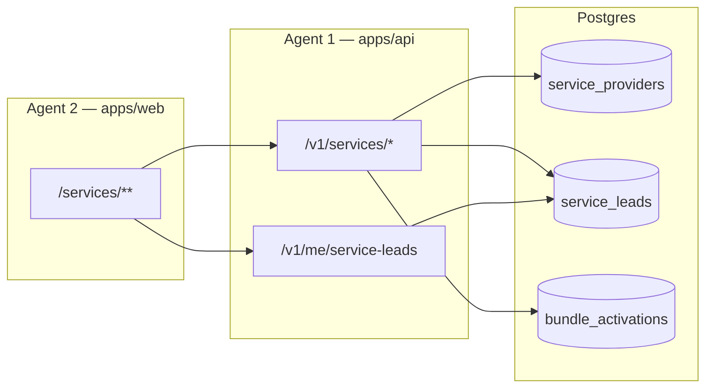

# ServiceHub Gap Closure — Stream 1 & Stream 2 Design & Architecture

**Date:** 2026-05-17  
**Audience:** Two parallel implementers (**Agent 1 — API & Data**, **Agent 2 — Web Marketplace**)  
**Goal:** Close the **remaining public ServiceHub + BUY-01 buyer ledger** gaps documented in [`PROJECT_GAP_CLOSURE.md`](./PROJECT_GAP_CLOSURE.md) §5.2 and [`SERVICEHUB_ROADMAP.md`](./SERVICEHUB_ROADMAP.md) §3.6–3.7.  
**Spec:** [ServiceHub Ecosystem Specification v1.0](../ServiceHub_Ecosystem_Specification_v1.0%20(1).md) §4 (SVC-PUB-01–06), buyer touchpoint BUY-01.

**This document is the single source of truth for the sprint.** If anything here conflicts with an older roadmap table, **this document wins**.

**Sprint status (2026-05-17):** **Closed** for required scope. Agents 1 and 2 tickets **A1–A4** and **B1–B6** are implemented in the repo (`e2e/servicehub-public.spec.ts` added). There was **no Agent 3** in this sprint (Provider OS = Stream 3, out of scope). Tracking tables in [`SERVICEHUB_ROADMAP.md`](./SERVICEHUB_ROADMAP.md) §3.6–3.7 and [`PROJECT_GAP_CLOSURE.md`](./PROJECT_GAP_CLOSURE.md) have been updated to match.

---

## 1. Executive summary

| Area | Before sprint | After sprint (achieved) |
|------|---------------|-------------------------|
| Public marketplace (SVC-PUB-01–06) | MVP shipped; **Partial** vs spec | **Shipped (MVP+)** — map toggle, SEO, bundle `developerProjectId`, no placeholder copy |
| Buyer service ledger (BUY-01) | API exists; UI **stub** | **Shipped** — dashboard + `/buyer/services` wired to API |
| Provider OS (PRV-04–11) | **Out of scope** for these two agents | Unchanged (owned by Stream 3) |
| WhatsApp / SEO admin / Paystack live | **Out of scope** | Unchanged |

**Two agents only.** Do not assign work to Stream 3–5 in this sprint except where Stream 2 adds Playwright smoke (optional, §6.2).

---

## 2. Agent roles (no overlap)

### Agent 1 — **Stream 1: API & Data**

| Owns | Does **not** touch |
|------|---------------------|
| `apps/api/**` | `apps/web/**` (except reading types for contract tests) |
| `apps/api/src/contracts/**` | Prisma changes **unless** listed in §4.1 (optional migration) |
| `apps/api/tests/servicehub-*.test.ts` | UI components, routes, CSS |
| `packages/db` **only** if §4.1 migration approved in same PR | Workers, admin SEO/WhatsApp |

### Agent 2 — **Stream 2: Web Marketplace**

| Owns | Does **not** touch |
|------|---------------------|
| `apps/web/app/services/**` | `apps/api/**`, Prisma, migrations |
| `apps/web/app/(dashboard)/buyer/services/**` | `apps/web/app/(dashboard)/provider/**` |
| `apps/web/components/servicehub/**` | New JSON fields without Agent 1 contract merged first |
| `apps/web/lib/api/services-marketplace.ts`, `buyer-portal.ts` (buyer leads client) | Provider portal, admin panel |
| `apps/web/app/listings/[slug]/page.tsx` **only** if embed props change (coordinate with Agent 1) | |

**Merge order:** Agent 1 contract PR **merges first** (or same stack with Agent 2 rebased on it). Agent 2 must not invent request/response shapes.

---

## 3. Architecture (data flow)



**Auth rules (do not reinterpret):**

| Endpoint | Auth |
|----------|------|
| `GET /v1/services`, categories, match, profile, reviews, bundles list | Guest OK |
| `POST /v1/services/:slug/quote` | Guest OK; if `Authorization` present, set `clientUserId` |
| `POST /v1/services/bundles/:id/activate` | **Required** (`requireAuth`) |
| `GET /v1/me/service-leads` | **Required** |
| `POST /v1/me/service-leads/:leadId/review` | **Required**; lead `status === completed` |

---

## 4. Agent 1 — deliverables (API & Data)

### 4.1 Ticket A1 — Formalize buyer service-leads contract

**Problem:** `GET /v1/me/service-leads` works (`me.service-leads.ts`) but there is **no Zod export** for the list response; Agent 2 cannot mirror types safely.

**Do:**

1. Create or extend `apps/api/src/contracts/me-service-leads.ts`:

```ts
// GET /v1/me/service-leads — response item (must match serviceLeadToClientJson)
export const meServiceLeadRowSchema = z.object({
  id: z.string().uuid(),
  status: z.nativeEnum(ServiceLeadStatus),
  source: z.nativeEnum(ServiceLeadSource),
  serviceRequested: z.string(),
  message: z.string(),
  location: z.string(),
  timeline: z.string().nullable(),
  budgetKobo: z.string().nullable(),
  quotedAmountKobo: z.string().nullable(),
  finalAmountKobo: z.string().nullable(),
  createdAt: z.string().datetime(),
  respondedAt: z.string().datetime().nullable(),
  completedAt: z.string().datetime().nullable(),
  provider: z.object({
    id: z.string().uuid(),
    businessName: z.string(),
    slug: z.string(),
    category: z.nativeEnum(ServiceCategory),
  }),
});

export const meServiceLeadsListResponseSchema = z.object({
  data: z.array(meServiceLeadRowSchema),
});
```

2. Update `serviceLeadToClientJson` in `apps/api/src/lib/serialize/service-lead-client.ts` to include `category` on `provider` (required for profile deep links).

3. Use `serviceLeadToClientJson` in the handler (already does); add Vitest in `apps/api/tests/servicehub-buyer-leads.test.ts`:
   - Authenticated buyer sees only own leads
   - 401 without token
   - Review POST 409 when lead not `completed`
   - Response item includes `provider.category`

**Do not:** Add pagination in this sprint unless `>100` leads is a product requirement (current `take: 100` stays).

---

### 4.2 Ticket A2 — Expose map coordinates on directory list

**Problem:** SVC-PUB-02 map toggle needs pin lat/lng. `GET /v1/services` filters by `lat`/`lng`/`radius_km` but **response rows omit coordinates** (`service-provider-public.ts`).

**Do:**

1. Extend `serviceProviderPublicListItem` return type with **optional** fields:

```ts
latitude: number | null;  // WGS84, from geom
longitude: number | null;
```

2. Populate in `GET /v1/services` handler:
   - After `findMany`, for rows with non-null `geom`, set lat/lng via **one** of:
     - **Preferred:** Raw SQL `ST_Y(geom::geometry)`, `ST_X(geom::geometry)` batched by ids, or
     - Prisma `$queryRaw` per page (max 50 rows).
   - If `geom` is null: `latitude: null`, `longitude: null` (UI hides pin).

3. Update `apps/api/src/contracts/servicehub-public.ts` — add to public list row schema (document as optional/nullable).

4. Vitest: seeded provider with geom returns numeric lat/lng; null geom returns nulls.

**Do not:** Add Mapbox server SDK. **Do not** change filter semantics for `lat`/`lng`.

---

### 4.3 Ticket A3 — Bundle activate: `developerProjectId`

**Problem:** Developer CTA passes `?projectId=` in URL; web only embeds it in `message` string. Product needs structured linkage for reporting.

**Do (no migration required for MVP):**

1. Extend `postActivateBundleBodySchema` in `servicehub-public.ts`:

```ts
developerProjectId: z.string().uuid().optional(),
```

2. In `activateServiceBundleTransaction` input, accept `developerProjectId: string | null`.

3. Persist without new column:
   - Append to lead `message` for each created lead: `\nDeveloper project: {uuid}` when present, **and**
   - Store in `bundle_activations.matchedProviders` JSON root metadata:

```json
{ "developerProjectId": "uuid", "slots": [ ... existing lead slots ... ] }
```

   (If current shape is array-only, wrap in `{ meta, slots }` and update serializer/tests — **document breaking change** in PR; update any code reading `matchedProviders` as array.)

4. Validate project exists and belongs to activating user when `developerProjectId` set:
   - `prisma.developerProject.findFirst({ where: { id, developer: { userId: authUser.id } } })`
   - Else `404 DEVELOPER_PROJECT_NOT_FOUND`

5. Vitest: activate with valid `developerProjectId` stores metadata; invalid id → 404.

**Agent 2** will pass `developerProjectId` from `searchParams.projectId` on bundles page/wizard (§5.3).

---

### 4.4 Ticket A4 — Quote auth linkage (verify only)

**Problem:** Buyer ledger empty if quotes submitted as guest.

**Do:**

1. Confirm `POST /v1/services/:slug/quote` sets `clientUserId: authUser.id` when Bearer token present (already at `services.ts` ~479).
2. Add Vitest if missing: authenticated quote → lead appears in `GET /me/service-leads`.

**Do not:** Require auth for public quote (spec allows guest quotes).

---

### 4.5 Ticket A5 — Optional: `GET /v1/me/service-leads/:id`

**Priority:** P2 — skip if sprint time short.

Single-lead detail for buyer review drawer. Only implement if Agent 2 implements detail route; otherwise list payload is sufficient.

---

### 4.6 Agent 1 — file checklist

| Action | Path |
|--------|------|
| Edit | `apps/api/src/contracts/me-service-leads.ts` |
| Edit | `apps/api/src/contracts/servicehub-public.ts` |
| Edit | `apps/api/src/lib/serialize/service-provider-public.ts` |
| Edit | `apps/api/src/routes/v1/services.ts` (list lat/lng) |
| Edit | `apps/api/src/lib/servicehub/bundle-activate.ts` |
| Edit | `apps/api/src/routes/v1/services.ts` (activate body) |
| Add | `apps/api/tests/servicehub-buyer-leads.test.ts` |
| Extend | `apps/api/tests/servicehub-public.test.ts` (lat/lng, developerProjectId) |

**Exit criteria:** `pnpm --filter @landshoppers/api test` green; PR title prefix `[ServiceHub S1]`.

---

## 5. Agent 2 — deliverables (Web Marketplace)

### 5.1 Ticket B1 — Wire BUY-01 buyer service ledger

**Problem:** `BuyerServiceHubPanel` and `/buyer/services` say “ledger API is wired in a later slice” but `GET /v1/me/service-leads` **already exists**.

**Do:**

1. Add to `apps/web/lib/api/buyer-portal.ts` (mirror Agent 1 contract exactly):

```ts
export type ApiBuyerServiceLead = { /* copy from meServiceLeadRowSchema */ }

export async function fetchBuyerServiceLeads() {
  return apiFetch<{ data: ApiBuyerServiceLead[] }>("/v1/me/service-leads", { auth: true })
}
```

2. Create `apps/web/components/servicehub/buyer-service-leads-list.tsx` (client):
   - `useSWR` + `getAccessToken()` pattern (copy `apps/web/app/(dashboard)/buyer/tours/page.tsx`)
   - States: loading, unauthenticated → link `/login?next=/buyer/services`, empty, error, list
   - Each row: provider name links to **`/services/{provider.category}/{provider.slug}`** (category comes from A1 schema)
   - Status badge mapped from `status` enum (pending, quoted, negotiating, accepted, completed, cancelled)
   - Dates: `createdAt`, `respondedAt`, `completedAt` when set
   - CTA: “Leave review” when `status === 'completed'` → opens dialog posting to `POST /v1/me/service-leads/:leadId/review` with fields from contract

3. Update `apps/web/components/servicehub/dashboard-servicehub-widgets.tsx`:
   - Replace dashed placeholder with `<BuyerServiceLeadsList compact />` on buyer dashboard
   - Remove copy “ledger API is wired in a later slice”

4. Update `apps/web/app/(dashboard)/buyer/services/page.tsx`:
   - Full-page `<BuyerServiceLeadsList />`

**Do not:** Create new API routes. **Do not** stub fake data when API returns `[]`.

---

### 5.2 Ticket B2 — SVC-PUB-02 directory map toggle

**Spec reference:** SVC-PUB-02 “Map View Toggle” — pins + mini popup + Request Quote.

**Do:**

1. Add `view=list|map` query param on:
   - `apps/web/app/services/[category]/page.tsx`
   - `apps/web/app/services/[category]/[segment]/page.tsx` (geo pages only; profile slug pages **no map**)

2. Extend `servicehub-directory-controls.tsx`:
   - Toggle buttons: List | Map
   - Preserve `sort`, `keyword`, `location` in URL when switching

3. Create `apps/web/components/servicehub/servicehub-directory-map.tsx`:
   - Client component; **reuse Leaflet** pattern from `apps/web/components/listings/listing-mini-map.tsx` (OpenStreetMap tiles — **do not** introduce Mapbox unless `NEXT_PUBLIC_MAPBOX_TOKEN` already in repo env example)
   - Props: `providers: ApiServiceProviderListItem[]` with `latitude?`, `longitude?`
   - Render pin only when both numbers non-null
   - Popup: business name, rating, “View profile” + “Request quote” (link to profile URL with `?quote=1`)

4. Extend `ApiServiceProviderListItem` in `services-marketplace.ts` with optional `latitude`, `longitude`; pass through `normalizeServiceProviderFromApi`.

5. Server page: pass providers from existing `tryFetchServiceProviders` fetch (no second fetch).

**Fallback:** If API returns all null coords, show inline message: “Map view requires provider locations — switch to list view.”

**Do not:** Block list view when map unavailable.

---

### 5.3 Ticket B3 — Bundle wizard: pass `developerProjectId`

**Do:**

1. `apps/web/lib/api/services-marketplace.ts` — extend `ActivateBundlePayload`:

```ts
developerProjectId?: string
```

2. `servicehub-bundle-wizard.tsx` — new prop `defaultDeveloperProjectId?: string`; include in `activateServiceBundle` body.

3. `servicehub-bundles-catalog.tsx` — pass from page searchParams.

4. `apps/web/app/services/bundles/page.tsx` — read `projectId` from searchParams → `defaultDeveloperProjectId={sp.projectId}`.

5. `apps/web/app/services/bundles/build/page.tsx` — same for custom builder message prefix (already has project message; optional pass-through if custom flow later calls activate).

**Blocked until:** Agent 1 Ticket A3 merged.

---

### 5.4 Ticket B4 — SVC-PUB-03 profile SEO

**Do:**

1. In `apps/web/app/services/[category]/[segment]/page.tsx` (profile branch only):
   - `generateMetadata` async: `title: {businessName} | {categoryLabel} | ServiceHub`
   - `description`: first 160 chars of provider description
   - `openGraph.title`, `openGraph.description` same

2. Canonical URL: `https://{env}/services/{category}/{slug}` — use existing site URL helper if present, else relative path in metadata only.

**Do not:** Change URL routing structure.

---

### 5.5 Ticket B5 — SVC-PUB-01 homepage spec parity (minimal)

**Do only these missing widgets (check before building):**

| Widget | Action |
|--------|--------|
| Trust stats strip | If missing, add 3 stats (verified count from API or static “500+ providers” with label “from ServiceHub directory”) |
| Testimonials | **Skip** this sprint (spec P2) |
| Category counts | Already from API — verify not hardcoded zero |

**Do not:** Redesign homepage layout.

---

### 5.6 Ticket B6 — Playwright smoke (optional P1)

**Only if** `apps/web/e2e` exists and CI runs it.

File: `apps/web/e2e/servicehub-public.spec.ts`

| Step | Assertion |
|------|-----------|
| Visit `/services` | Heading visible |
| Click first category | URL `/services/{category}` |
| Guest quote on demo provider | Form submits without 5xx (mock API or test env) |

**Do not:** Block Agent 1 merge on E2E.

---

### 5.7 Agent 2 — file checklist

| Action | Path |
|--------|------|
| Edit | `apps/web/lib/api/buyer-portal.ts` |
| Edit | `apps/web/lib/api/services-marketplace.ts` |
| Add | `apps/web/components/servicehub/buyer-service-leads-list.tsx` |
| Add | `apps/web/components/servicehub/servicehub-directory-map.tsx` |
| Edit | `apps/web/components/servicehub/dashboard-servicehub-widgets.tsx` |
| Edit | `apps/web/app/(dashboard)/buyer/services/page.tsx` |
| Edit | `apps/web/app/services/[category]/page.tsx` |
| Edit | `apps/web/app/services/[category]/[segment]/page.tsx` |
| Edit | `apps/web/app/services/[category]/servicehub-directory-controls.tsx` |
| Edit | `apps/web/components/servicehub/servicehub-bundle-wizard.tsx` |
| Edit | `apps/web/app/services/bundles/page.tsx` |
| Optional | `apps/web/e2e/servicehub-public.spec.ts` |

**Exit criteria:** `pnpm --filter web lint` + manual path: sign in → `/buyer/services` shows leads after test quote.

---

## 6. Sequencing (calendar)

| Day | Agent 1 | Agent 2 |
|-----|---------|---------|
| **D1** | A1 contract + tests; start A2 lat/lng | B4 SEO metadata; B5 homepage check |
| **D2** | A2 finish; A3 developerProjectId | B1 buyer ledger (blocked on A1 contract types — use temporary local type matching serializer until merge) |
| **D3** | A4 verify quote linkage; PR ready | B2 map toggle (blocked on A2 — use mock lat/lng in dev only until merge) |
| **D4** | Address review | B3 bundle projectId after A3 merge |
| **D5** | Both: integration test on staging; update `SERVICEHUB_ROADMAP.md` §3.6–3.7 statuses |

**Daily sync (15 min):** Contract diff only — no scope creep.

---

## 7. Definition of done (sprint)

| ID | Done when |
|----|-----------|
| **BUY-01** | Buyer dashboard + `/buyer/services` render real leads; review dialog works on `completed` lead |
| **SVC-PUB-02** | List/Map toggle on category + geo directory; pins when API returns lat/lng |
| **SVC-PUB-03** | `generateMetadata` on provider profile |
| **SVC-PUB-04** | Bundle activate sends `developerProjectId` when `?projectId=` present |
| **Contracts** | Agent 1 Zod schemas merged; Agent 2 types match |
| **Docs** | `SERVICEHUB_ROADMAP.md` row statuses updated in same release PR or immediate follow-up |

**Sprint is NOT done if:**

- Buyer panel still shows “ledger API is wired in a later slice”
- Map toggle shipped without API lat/lng (unless documented as list-only fallback)
- Agent 2 added fields to API responses without Agent 1 contract

---

## 8. Explicitly out of scope (do not start)

| Item | Owner |
|------|--------|
| Provider OS pages `/provider/*` depth | Stream 3 |
| `GET /v1/agent/preferred-partners` + AGT-01 ledger | Agent portal stream |
| Admin ServiceHub `ADM-08` CRUD | Stream 5 / Admin |
| WhatsApp Evolution, Paystack live webhooks | Stream 4 |
| Mapbox GL migration (Leaflet OK for MVP) | Future |
| Prisma migration for `bundle_activations.developerProjectId` column | Optional later; JSON metadata is enough for this sprint |
| New public routes under `/services` | Forbidden unless PM CR |

---

## 9. Environment & demo data

| Variable | Used by |
|----------|---------|
| `DATABASE_URL` | Agent 1 tests |
| `NEXT_PUBLIC_API_URL` | Agent 2 |
| PostGIS | Required for A2 lat/lng integration tests |

**Demo fallback:** Agent 2 **keeps** existing `DEMO_SERVICE_PROVIDERS` for directory when API 404/501 — **except** buyer leads list (never demo fake leads).

---

## 10. PR template (both agents)

```markdown
## ServiceHub Stream [1|2] — [Ticket IDs]

**Spec:** SVC-PUB-02 / BUY-01 / …
**Depends on:** #PR-number or none

### Changes
- …

### Test plan
- [ ] Vitest (S1) / manual (S2)
- [ ] Contract matches me-service-leads.ts

### Out of scope acknowledged
- [ ] No web changes in S1 PR / No API changes in S2 PR
```

---

## 11. Status tracking after merge

**Done (2026-05-17).** Rows updated in [`SERVICEHUB_ROADMAP.md`](./SERVICEHUB_ROADMAP.md) §3.6–3.7 and [`PROJECT_GAP_CLOSURE.md`](./PROJECT_GAP_CLOSURE.md) §5.2:

| Row | Status |
|-----|--------|
| SVC-PUB-02 | **Shipped (MVP)** |
| SVC-PUB-03 | **Shipped (MVP)** |
| SVC-PUB-04 | **Shipped** |
| Buyer service ledger (BUY-01) | **Shipped (MVP)** |
| B6 optional E2E | **Not started** (optional) |

---

*Questions go to PM with page ID + stream number. Do not expand scope in PR comments without CR.*
