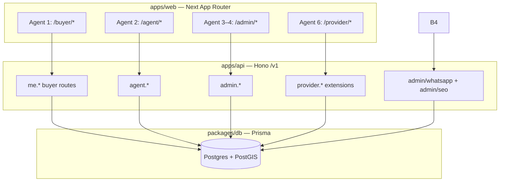
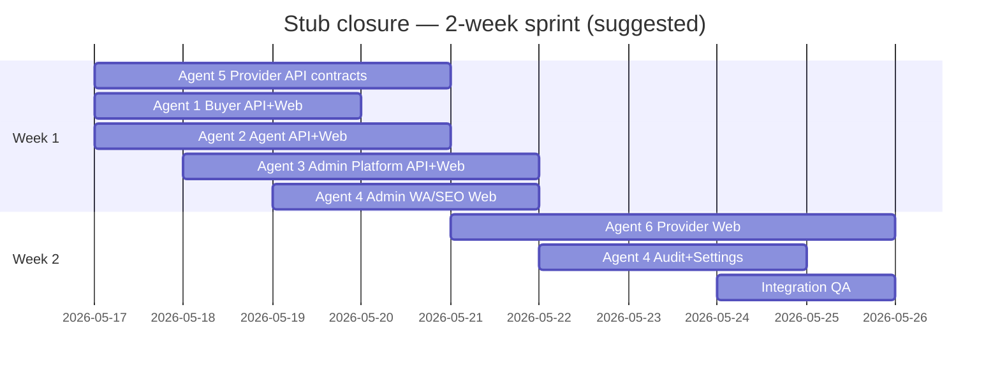

# Stub Pages — Six-Agent Working Architecture

**Date:** 2026-05-16  
**Scope:** Replace every **stub/placeholder** route listed below with production MVP UI wired to real APIs.  
**Out of scope:** New routes (e.g. `/buyer/messages`), full Paystack live webhooks, Evolution WhatsApp pods, Socket.io — those stay on the main gap roadmap.

| # | Agent codename | Stub routes | Primary layer |
|---|----------------|-------------|---------------|
| **1** | **Buyer** | `/buyer/settings`, `/buyer/tours` | API + Web |
| **2** | **AgentOS** | `/agent/analytics`, `/agent/subscription`, `/agent/settings` | API + Web |
| **3** | **Admin Platform** | `/admin/users`, `/admin/payments`, `/admin/analytics`, `/admin/reports` | API + Web |
| **4** | **Admin Automation** | `/admin/audit-logs`, `/admin/settings`, `/admin/whatsapp`, `/admin/seo` | API + Web (WA/SEO APIs largely exist) |
| **5** | **Provider API** | Backing APIs for all 8 provider stubs | API + contracts |
| **6** | **Provider Web** | `/provider/analytics`, `jobs`, `whatsapp`, `reviews`, `content`, `kyc`, `subscription`, `settings` | Web only |

**Reference implementations (copy patterns, do not fork style):**

- Developer settings: `apps/web/app/(dashboard)/developer/settings/page.tsx` + `me.developer.settings.ts`
- Developer subscription: `developer/subscription/page.tsx` + `me.developer.subscription.ts`
- Admin listings (real): `admin/listings/page.tsx` + `admin.ts`
- Provider leads (real): `provider/leads/page.tsx` + `provider.ts`
- Admin WhatsApp/SEO APIs (already shipped): `admin-whatsapp.ts`, `admin-seo.ts`

---

## 0. System context



**Auth:** All dashboard routes use `Authorization: Bearer` from `getAccessToken()` / `apiFetch({ auth: true })`. Server middleware: `requireAuth` + role guard (`requireAdmin`, `requireAgentOrDeveloper`, `requireServiceProvider`).

**Contracts rule:** Every new JSON field lands in `apps/api/src/contracts/*.ts` first; mirror types in `apps/web/lib/api/*.ts`. Agent 5 opens PRs with Vitest green before Agent 6 merges UI.

---

## 1. Shared integration contract (all six agents)

### 1.1 Response envelopes

```ts
// List
{ data: T[], meta: { page, pageSize, total, totalPages } }

// Single resource
{ data: T }

// Errors (existing ApiError)
{ error: { code, message } }
```

### 1.2 Web data fetching

| Pattern | Use |
|---------|-----|
| `useSWR` + bearer | Forms and dashboards (developer settings) |
| `usePortalData` hook | Tables with `PortalAuthRequired` / `PortalEmpty` / `PortalError` (buyer saved, admin listings) |
| `sonner` toast | Mutations (approve, save, cancel tour) |

### 1.3 Audit logging (Agents 3, 4, 5 when mutating)

Write `AuditLog` on admin/provider mutations:

```ts
await prisma.auditLog.create({
  data: {
    actorId: authUser.id,
    actorEmail: authUser.email,
    actorRole: authUser.role,
    action: "admin.user.suspend", // namespaced string
    targetType: "user",
    targetId: userId,
    changes: { before, after },
    ipAddress: c.req.header("x-forwarded-for") ?? null,
  },
})
```

### 1.4 Tier gating (Agents 2, 6)

Server returns `tier` + `limits`; web uses `TierGate` / disabled tooltips — never hide paid features only in CSS without API 403 on mutation.

### 1.5 File layout convention

| Layer | New files |
|-------|-----------|
| API route | `apps/api/src/routes/v1/me.<feature>.ts` or extend `admin.ts` / `agent.ts` / `provider.ts` |
| Contract | `apps/api/src/contracts/<portal>-<feature>.ts` |
| Serializer | `apps/api/src/lib/serialize/<entity>.ts` |
| Lib | `apps/api/src/lib/<domain>-*.ts` (aggregates) |
| Test | `apps/api/tests/<feature>.test.ts` + `fake-prisma` updates |
| Web client | `apps/web/lib/api/<portal>-portal.ts` or extend `portal.ts` |
| Page | Replace stub `page.tsx`; delete `ProviderRoadmapStub` import |

---

## 2. Agent 1 — Buyer (`BUYER-SETTINGS`, `BUYER-TOURS`)

### 2.1 Ownership

| Owns | Must not own |
|------|----------------|
| `me.settings.ts`, `me.tours.ts`, contracts, serializers | Agent/admin/provider routes |
| `apps/web/.../buyer/settings`, `buyer/tours` | `UserProfile` schema changes without migration PR |

### 2.2 Routes to replace

| Route | Current | Target |
|-------|---------|--------|
| `/buyer/settings` | `PortalEmpty` | Profile + notification prefs form |
| `/buyer/tours` | `PortalEmpty` | Tour list + request/cancel |

### 2.3 Data model (existing — no migration required for MVP)

```prisma
UserProfile {
  notifyEmail, notifySms, notifyPush
  preferences Json?  // optional: { marketing: boolean, searchAlerts: boolean }
}
TourRequest {
  buyerId, listingId, agentId?, tourType, status
  preferredDate, preferredTime, confirmedDate?, notes?, cancelReason?
}
Notification // for future /buyer/notifications — seed on tour confirm
```

### 2.4 API design

**Mount:** `meV1.route("/settings", meSettingsV1)` and `meV1.route("/tours", meToursV1)` in `me.ts`.

| Method | Path | Auth | Body / query | Response |
|--------|------|------|--------------|----------|
| `GET` | `/v1/me/settings` | buyer+ | — | `{ data: { email, phone, profile, notifications, preferences } }` |
| `PATCH` | `/v1/me/settings` | buyer+ | `patchMeSettingsBodySchema` | Updated same shape |
| `GET` | `/v1/me/tours` | buyer+ | `page`, `pageSize`, `status?`, `upcoming?` | Paginated tour rows + listing summary |
| `POST` | `/v1/me/tours` | buyer+ | `{ listingId, tourType, preferredDate, preferredTime?, notes?, buyerPhone? }` | Created tour |
| `PATCH` | `/v1/me/tours/:id` | buyer+ | `{ status: "cancelled", cancelReason? }` or `{ notes? }` | Updated tour |
| `POST` | `/v1/me/tours/:id/cancel` | buyer+ | `{ cancelReason? }` | Shortcut cancel → `cancelled` |

**`patchMeSettingsBodySchema` (Zod):**

```ts
{
  firstName?, lastName?, city?, state?, country?, avatarUrl?,
  phone?,  // updates User.phone if role allows
  notifyEmail?, notifySms?, notifyPush?,
  preferences?: Record<string, unknown> | null
}
```

**Tour list item JSON:**

```ts
{
  id, status, tourType,
  preferredDate, preferredTime, confirmedDate,
  listing: { id, slug, title, city, thumbnailUrl },
  agent: { id, agencyName } | null,
  notes, cancelReason, createdAt
}
```

**Business rules:**

- `POST /tours`: resolve `agentId` from `listing.agentId`; reject if listing not `active`.
- Buyer may only `PATCH` own tours; cancel only from `pending` | `confirmed`.
- On `POST` tour: insert `Notification` type `inquiry` for agent user (if agent linked).

### 2.5 Web architecture

```
apps/web/app/(dashboard)/buyer/settings/page.tsx
  └─ BuyerSettingsForm (client)
       ├─ useSWR("buyer:settings", fetchBuyerSettings)
       ├─ sections: Profile | Notifications | Security (link /reset-password)
       └─ PATCH on save → toast + mutate

apps/web/app/(dashboard)/buyer/tours/page.tsx
  └─ BuyerToursTable
       ├─ tabs: Upcoming | Past | Cancelled
       ├─ usePortalData + fetchBuyerTours
       └─ row actions: Cancel (dialog), View listing (link)
```

**Extend:** `apps/web/lib/api/buyer-portal.ts` (new) — do not bloat `portal.ts` further.

### 2.6 Tests

- `apps/api/tests/me-settings.test.ts` — PATCH toggles `notifyEmail`
- `apps/api/tests/me-tours.test.ts` — create, list, cancel, 403 wrong buyer
- Playwright: login as seed buyer → settings save → tours tab visible

### 2.7 MVP vs Phase 2

| MVP (this sprint) | Phase 2 |
|-------------------|---------|
| Profile + notify toggles | Avatar S3 upload |
| Tour CRUD for buyer | Agent confirm/reschedule API |
| — | Email to agent on new tour (Resend worker) |

---

## 3. Agent 2 — AgentOS (`AGT-07`, `AGT-10`, `AGT-11`)

### 3.1 Ownership

| Owns | Must not own |
|------|----------------|
| `agent.analytics.ts`, `agent.subscription.ts`, `agent.settings.ts` (or extend `agent.ts`) | Developer `me.developer.*` |
| `/agent/analytics`, `/agent/subscription`, `/agent/settings` | Paystack webhook handler (shared worker later) |

### 3.2 Routes to replace

| Route | Current | Target |
|-------|---------|--------|
| `/agent/analytics` | `PortalEmpty` | Charts from analytics API |
| `/agent/subscription` | `PortalEmpty` | Plan card + checkout (mirror developer) |
| `/agent/settings` | `PortalEmpty` | Agency + notification prefs |

### 3.3 Existing assets to reuse

- `GET /v1/agent/dashboard` — KPIs, `limits`, `usage` (`agent-portal-dashboard.ts`)
- `GET /v1/agent/context` — tier, `paystackConfigured`
- `Subscription` model with `agentId` + `SubscriptionPlan` (`agent_basic`, `agent_pro`)
- `Agent` model: `agencyName`, `licenseNumber`, notification fields on `UserProfile`

### 3.4 API design

| Method | Path | Description |
|--------|------|-------------|
| `GET` | `/v1/agent/analytics/summary` | `period=week\|month\|quarter\|all` → series for views, inquiries, conversion |
| `GET` | `/v1/agent/subscription` | Current sub + usage vs `limitsForTier` |
| `GET` | `/v1/agent/subscription/invoices` | Paginated `Payment` where `agentId` matches |
| `POST` | `/v1/agent/subscription/checkout` | `{ plan: "agent_basic" \| "agent_pro" }` → stub `authorizationUrl` if Paystack keys set else 503 |
| `GET` | `/v1/agent/settings` | Agent + profile + notify flags |
| `PATCH` | `/v1/agent/settings` | Partial agency + profile + notify |

**`GET /v1/agent/analytics/summary` payload:**

```ts
{
  period: string,
  kpis: {
    views: { byDay: { date, count }[], total, changePercent },
    inquiries: { byDay, byStatus: Record<string, number>, total },
    conversionRatePercent: number | null,
    topListings: { listingId, title, views, inquiries }[]  // cap 5
  },
  tier: "free" | "pro" | "elite",
  analyticsDepth: "basic" | "full"  // free → basic (30d only)
}
```

**Data sources:** `listingRecentView`, `inquiry` (agentId or listing ownership), reuse queries from `buildAgentPortalDashboard`.

### 3.5 Web architecture

Mirror `developer/analytics/page.tsx` (Recharts) and `developer/subscription/page.tsx`.

```
apps/web/lib/api/agent-portal.ts        // extend existing exports
apps/web/app/(dashboard)/agent/analytics/page.tsx
apps/web/app/(dashboard)/agent/subscription/page.tsx
apps/web/app/(dashboard)/agent/settings/page.tsx
```

**Analytics page layout:**

1. Period selector (week/month/quarter)
2. Row of stat cards (reuse dashboard KPI components)
3. `AreaChart` views by day, `BarChart` inquiries by status
4. `TierGate` for elite-only “top listings” table

### 3.6 Tests

- `agent-analytics.test.ts`, `agent-subscription.test.ts`, `agent-settings.test.ts`
- Extend `fake-prisma` with `Payment`, `Subscription` fixtures

### 3.7 Dependencies

- **Agent 1:** none
- **Blocked by:** none for MVP (stub Paystack URL acceptable)

---

## 4. Agent 3 — Admin Platform (`ADM-06`, `ADM-07`, ADM-01 partial, reports)

### 4.1 Ownership

| Owns | Must not own |
|------|----------------|
| `admin.users.ts`, `admin.payments.ts`, `admin.analytics.ts`, `admin.reports.ts` | WhatsApp/SEO routes (Agent 4) |
| `/admin/users`, `payments`, `analytics`, `reports` | ServiceHub admin (separate spec) |

### 4.2 Routes to replace

| Route | Spec | Target UI |
|-------|------|-----------|
| `/admin/users` | ADM-06 | Searchable user table, role filter, suspend |
| `/admin/payments` | ADM-07 | Payment ledger + subscription summary |
| `/admin/analytics` | ADM-01 | Platform KPI cards + trends |
| `/admin/reports` | — | CSV export of listings/users/payments (MVP) |

### 4.3 API design

Mount under `adminV1` in `admin.ts` or split files mounted in `index.ts`:

| Method | Path | Query | Notes |
|--------|------|-------|-------|
| `GET` | `/v1/admin/users` | `page`, `pageSize`, `role?`, `q?`, `status?` | Join profile; mask password |
| `PATCH` | `/v1/admin/users/:id` | `{ suspended?: boolean, role? }` | Super-admin only for role change |
| `GET` | `/v1/admin/payments` | `page`, `status?`, `type?`, `from?`, `to?` | `Payment` + agent join |
| `GET` | `/v1/admin/payments/summary` | `period` | GMV, count by status, subscription MRR estimate |
| `GET` | `/v1/admin/analytics/summary` | `period` | DAU proxy: users with `lastLoginAt`, listing counts, inquiry counts, pending KYC count |
| `GET` | `/v1/admin/reports/:kind` | `kind=listings\|users\|payments`, `format=csv` | Stream CSV; rate-limit 10/hour/admin |

**User row JSON:**

```ts
{ id, email, role, isEmailVerified, lastLoginAt, createdAt,
  profile: { firstName, lastName, city } | null,
  flags: { suspended: boolean }  // derive from deletedAt or new field — MVP: deletedAt != null
}
```

**MVP suspension:** Use `User.deletedAt` soft-delete OR add `suspendedAt` in a small migration (Agent 3 owns migration if product insists on non-delete suspend).

### 4.4 Web architecture

```
apps/web/lib/api/admin-portal.ts   // new
apps/web/app/(dashboard)/admin/users/page.tsx      // Table + Sheet detail
apps/web/app/(dashboard)/admin/payments/page.tsx   // Summary cards + ledger table
apps/web/app/(dashboard)/admin/analytics/page.tsx  // KPI grid + simple charts
apps/web/app/(dashboard)/admin/reports/page.tsx    // Report type buttons → download
```

Follow `admin/listings/page.tsx` for table + dialog patterns.

### 4.5 Tests

- `admin-users.test.ts` — list, patch suspend, 403 non-admin
- `admin-payments.test.ts` — list + summary
- `admin-analytics.test.ts` — summary shape

---

## 5. Agent 4 — Admin Automation (`ADM-09`, `ADM-10`, `ADM-11`, `ADM-12`)

### 5.1 Critical finding: APIs already exist

| Stub page | Existing API | Gap |
|-----------|--------------|-----|
| `/admin/whatsapp` | `GET /v1/admin/whatsapp/reviews`, `POST .../approve`, `POST .../reject` | **Web UI only** (+ optional summary endpoint) |
| `/admin/seo` | `GET /v1/admin/seo/variants`, `POST .../approve` | **Web UI only** (+ reject if added) |

Agent 4 is primarily **frontend + thin admin wrappers**, not greenfield backend.

### 5.2 Routes to replace

| Route | Target |
|-------|--------|
| `/admin/whatsapp` | Queue table + detail drawer + approve/reject |
| `/admin/seo` | Variant approval queue |
| `/admin/audit-logs` | Paginated audit table |
| `/admin/settings` | Feature flags + platform config (env-backed MVP) |

### 5.3 API additions (small)

| Method | Path | Purpose |
|--------|------|---------|
| `GET` | `/v1/admin/whatsapp/summary` | `{ pending, processed, approvedToday }` |
| `GET` | `/v1/admin/seo/summary` | `{ draft, approved, pendingPost }` |
| `GET` | `/v1/admin/audit-logs` | `page`, `action?`, `actorId?`, `from?`, `to?` |
| `GET` | `/v1/admin/settings` | Read-only platform config snapshot |
| `PATCH` | `/v1/admin/settings` | MVP: `{ maintenanceMode?, whatsappAutoApproveMinScore? }` stored in DB `PlatformSettings` **or** env-only with 501 for PATCH |

**Optional:** `POST /v1/admin/seo/variants/:id/reject` — mirror WhatsApp reject.

**Audit serializer:**

```ts
{ id, action, actorEmail, actorRole, targetType, targetId, createdAt, changesPreview }
```

### 5.4 Web architecture — WhatsApp page

```
/admin/whatsapp/page.tsx
  ├─ Summary cards (fetchAdminWhatsappSummary)
  ├─ DataTable from fetchAdminWhatsappReviews({ status })
  ├─ Row: confidence, sender, preview text, receivedAt
  └─ Actions: Approve → creates listing (existing API), Reject → dialog + reason

/admin/whatsapp (no child routes in MVP — use Dialog for detail)
  Detail drawer shows extractedData JSON + mediaUrls thumbnails
```

**Client functions in `admin-portal.ts`:**

```ts
fetchAdminWhatsappReviews(params)
approveAdminWhatsappReview(id)
rejectAdminWhatsappReview(id, { reason })
fetchAdminSeoVariants(params)
approveAdminSeoVariant(id)
```

Copy mutation error handling from `admin/listings/page.tsx`.

### 5.5 Web architecture — SEO page

- Table of variants: listing title (join), variantType, seoTitle, status, createdAt
- Approve button → `POST /variants/:id/approve`
- Filter: `status=draft` default

### 5.6 Web architecture — Audit logs & settings

- **Audit:** read-only table, filters, export CSV (reuse Agent 3 report helper)
- **Settings:** form with maintenance toggle (if DB table exists) else display env vars read-only + copy for DevOps

### 5.7 Tests

- Extend `automation-admin.test.ts` (already covers WA + SEO approve)
- `admin-audit-logs.test.ts`

### 5.8 Dependencies

- **Agent 3:** shared `admin-portal.ts` client file — coordinate via PR merge order or single `admin-portal.ts` with namespaced exports

---

## 6. Agent 5 — Provider API (ServiceHub PRV-04–11 backends)

### 6.1 Ownership

| Owns | Must not own |
|------|----------------|
| All new `/v1/provider/*` routes below | `apps/web` except contract types |
| `contracts/provider-*.ts`, serializers, Vitest | Public `/v1/services/*` breaking changes |

### 6.2 Stub pages served (Agent 6 consumes)

| PRV | Route | API prefix |
|-----|-------|------------|
| PRV-04 | `/provider/jobs` | `/v1/provider/jobs` |
| PRV-05 | `/provider/whatsapp` | `/v1/provider/whatsapp` |
| PRV-06 | `/provider/analytics` | `/v1/provider/analytics` |
| PRV-07 | `/provider/reviews` | `/v1/provider/reviews` |
| PRV-08 | `/provider/content` | `/v1/provider/content` |
| PRV-09 | `/provider/kyc` | `/v1/provider/kyc` |
| PRV-10 | `/provider/subscription` | `/v1/provider/subscription` |
| PRV-11 | `/provider/settings` | `/v1/provider/settings` |

### 6.3 Domain mapping (jobs = service leads)

No separate `Job` table in MVP — **map job lifecycle to `ServiceLead.status`:**

| Kanban column | `ServiceLeadStatus` |
|---------------|---------------------|
| Quoted | `quoted` |
| Accepted | `accepted` |
| In Progress | `negotiating` or new value `in_progress` *(migration if missing)* |
| Completed | `completed` |
| Cancelled | `cancelled` |

Check enum in schema; add `in_progress` via migration if product requires distinct state.

### 6.4 API surface (MVP)

| Method | Path | MVP behaviour |
|--------|------|---------------|
| `GET` | `/provider/jobs` | Paginated leads where status ∈ job statuses; include client mask, amounts |
| `PATCH` | `/provider/jobs/:id` | `{ status }` with `assertServiceLeadStatusTransition` |
| `GET` | `/provider/analytics/summary` | Funnel counts, response time histogram (basic), revenue from `quotedAmountKobo` / `finalAmountKobo` |
| `GET` | `/provider/reviews` | List `ServiceReview` for provider |
| `PATCH` | `/provider/reviews/:id` | `{ providerResponse }` |
| `GET` | `/provider/kyc` | `verificationLevel`, `kycDocuments` JSON, checklist meta |
| `PATCH` | `/provider/kyc` | Update `licenseNumber`, upload metadata (HTTPS URL like developer KYC) |
| `GET` | `/provider/subscription` | `subscriptionTier` on `ServiceProvider` + usage counts |
| `POST` | `/provider/subscription/checkout` | Body `{ tier: "pro" \| "elite" }` → update `subscriptionTier` on success stub |
| `GET` | `/provider/settings` | Notify prefs + lead prefs (store in `UserProfile.preferences.serviceProvider`) |
| `PATCH` | `/provider/settings` | Partial notify + lead filters |
| `GET` | `/provider/whatsapp` | Read `ProviderWhatsAppConnection` or empty |
| `PATCH` | `/provider/whatsapp` | MVP: toggle `whatsappConnected` + store phone; full Evolution → Phase 2 |
| `POST` | `/provider/content/generate` | Stub: template captions from lead/category; AI → Phase 2 |

**Tier gating:** Pro/Elite checks in route handlers using `tierFromServiceProvider` — return `403 FEATURE_GATED` for analytics depth, WhatsApp, content AI.

### 6.5 File plan

```
apps/api/src/routes/v1/provider.jobs.ts
apps/api/src/routes/v1/provider.analytics.ts
apps/api/src/routes/v1/provider.reviews.ts
apps/api/src/routes/v1/provider.kyc.ts
apps/api/src/routes/v1/provider.subscription.ts
apps/api/src/routes/v1/provider.settings.ts
apps/api/src/routes/v1/provider.whatsapp.ts
apps/api/src/routes/v1/provider.content.ts
apps/api/src/contracts/provider-*.ts
apps/api/tests/provider-*.test.ts
```

Mount in `provider.ts`:

```ts
providerScopedV1.route("/jobs", providerJobsV1);
// ...
```

### 6.6 Tests & handoff to Agent 6

- Each route file ≥1 happy path + 403 wrong role + tier gate case
- Publish OpenAPI-style table in PR description
- **Freeze contracts** before Agent 6 starts UI (mid-week sync)

---

## 7. Agent 6 — Provider Web (consume Agent 5)

### 7.1 Ownership

| Owns | Must not own |
|------|----------------|
| 8 `page.tsx` files under `provider/` | `apps/api` except type imports |
| `lib/api/provider-portal.ts` extensions | Prisma |

### 7.2 Per-page component map

| Page | Components | Pattern source |
|------|------------|----------------|
| `jobs` | `ProviderJobsKanban`, `JobDetailDrawer` | `provider/leads` + dnd-kit optional |
| `analytics` | `ProviderAnalyticsCharts` | `developer/analytics` |
| `reviews` | `ReviewCard`, `ReplyComposer` | New |
| `content` | `ContentGenerateForm`, output cards | Simplified `agent` content stub spec |
| `kyc` | `VerificationJourney`, doc upload | `developer/kyc` |
| `subscription` | Plan cards, usage meters | `developer/subscription` |
| `settings` | Toggle grid, sections | `developer/settings` |
| `whatsapp` | Connection state, keyword list (read-only if bridge off) | Feature flag `PROVIDER_WHATSAPP_ENABLED` |

### 7.3 Remove stub infrastructure

After all pages ship:

- Delete imports of `ProviderRoadmapStub` from each page
- Keep `provider/_stub.tsx` only if one route remains deferred; otherwise remove file

### 7.4 E2E

Extend `apps/web/e2e/servicehub.spec.ts`:

- Provider login → jobs kanban renders
- Settings save toggles notify flag

---

## 8. Cross-agent dependency graph



| Dependency | Blocker | Mitigation |
|------------|---------|------------|
| Agent 6 → Agent 5 | No provider APIs | Agent 5 merges contracts day 2; Agent 6 uses MSW/fixtures until then |
| Agent 4 WhatsApp UI | None | APIs exist — start day 1 |
| Agent 3 + 4 | `admin-portal.ts` merge conflicts | Split: `admin-portal.users.ts` re-exported from barrel |
| All → Audit | Optional | Agent 3/4/5 call shared `writeAuditLog()` helper in `apps/api/src/lib/audit.ts` |

---

## 9. Implementation sequence (per agent, day-by-day)

### Agent 1 — Buyer

1. Contract + `me.settings` GET/PATCH + tests  
2. Contract + `me.tours` CRUD + tests  
3. `buyer-portal.ts` client  
4. Settings page  
5. Tours page  
6. Playwright smoke  

### Agent 2 — AgentOS

1. `agent.settings` GET/PATCH  
2. `agent.subscription` (copy developer subscription handler, swap `agentId`)  
3. `agent.analytics/summary` aggregate lib  
4. Three pages + charts  
5. Tests  

### Agent 3 — Admin Platform

1. `admin.users` list/patch + audit log  
2. `admin.payments` list + summary  
3. `admin.analytics/summary`  
4. `admin.reports` CSV  
5. Four pages  

### Agent 4 — Admin Automation

1. `admin-portal.ts` WhatsApp + SEO client wrappers  
2. `/admin/whatsapp` full UI (highest business value)  
3. `/admin/seo` UI  
4. `admin.audit-logs` API + page  
5. `/admin/settings` MVP  

### Agent 5 — Provider API

1. `provider.settings` + `provider.subscription` (unblocks 6)  
2. `provider.jobs` + status machine  
3. `provider.analytics` + `provider.reviews`  
4. `provider.kyc` + `provider.whatsapp` (read MVP)  
5. `provider.content` stub POST  

### Agent 6 — Provider Web

1. Subscription + settings (simple forms)  
2. Jobs kanban  
3. Analytics + reviews  
4. KYC + WhatsApp  
5. Content studio minimal  

---

## 10. Definition of done (stub closure)

A stub route is **closed** when:

1. `PortalEmpty` / `ProviderRoadmapStub` removed from that `page.tsx`.  
2. Page loads authenticated data from `/v1/*` with loading, empty, and error states.  
3. At least one mutation path works end-to-end (where applicable).  
4. Vitest covers new API routes; Playwright or manual test noted in PR.  
5. Nav link in portal layout unchanged (routes already wired).  
6. PR lists page ID (BUY-05, AGT-07, PRV-04, etc.).

---

## 11. Environment variables (shared)

| Variable | Agents | Purpose |
|----------|--------|---------|
| `PAYSTACK_PUBLIC_KEY`, `PAYSTACK_SECRET_KEY` | 2, 5, 6 | Stub checkout URLs |
| `PROVIDER_WHATSAPP_ENABLED` | 5, 6 | Hide Evolution UI |
| `AGENT_WHATSAPP_ENABLED` | 2 | Future |
| `RESEND_API_KEY`, `EMAIL_FROM` | 1 | Tour notification email (Phase 2) |
| `WHATSAPP_DEFAULT_LISTING_USER_ID` | 4 | WA approve listing owner |

---

## 12. Risk register

| Risk | Impact | Mitigation |
|------|--------|------------|
| `ServiceLeadStatus` missing `in_progress` | Jobs kanban blocked | Agent 5 adds migration early |
| Paystack not configured | Subscription pages 503 | Show tooltips like developer subscription |
| Admin PATCH settings without DB table | Incomplete ADM-12 | Env-readonly UI + ticket for `PlatformSettings` model |
| Agent 6 starts before contracts freeze | Rework | Agent 5 posts contract Zod in shared Slack/PR by EOD day 2 |

---

*Stub closure complete — [`PROJECT_GAP_CLOSURE.md`](./PROJECT_GAP_CLOSURE.md) §5.1 updated 2026-05-17. Regenerate [`WEB_ROUTE_INVENTORY.md`](./WEB_ROUTE_INVENTORY.md) with `pnpm run routes:inventory` when convenient.*

---

## 13. Post-stub follow-up (2026-05-16)

| Item | Status |
|------|--------|
| All 19 stub routes → real UI + API | **Done** |
| Listing detail: inquiry + tour request wired to API | **Done** — `InquiryForm`, `TourRequestDialog`, `createBuyerTour` |
| `admin-reports.test.ts` | **Done** |
| Playwright `e2e/stub-portals.spec.ts` | **Done** — buyer, agent, admin reports, provider jobs |
| Live Paystack / Evolution WhatsApp | **Phase 2** — env-dependent |
| Full E2E against live API | **Optional** — extend `stub-portals.spec.ts` or add integration job |
